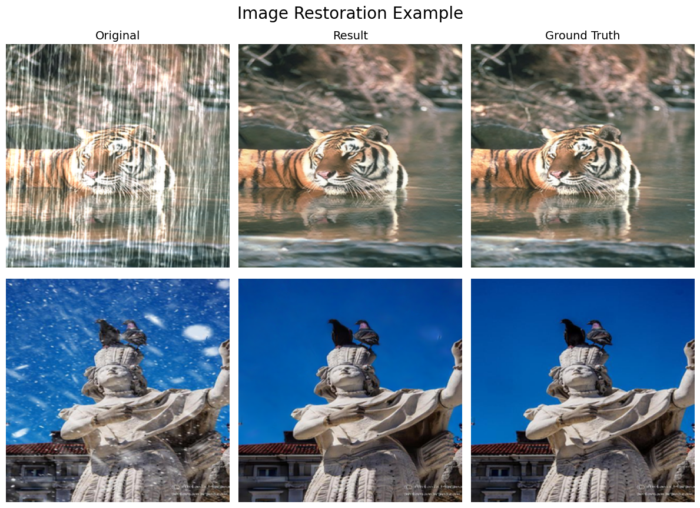
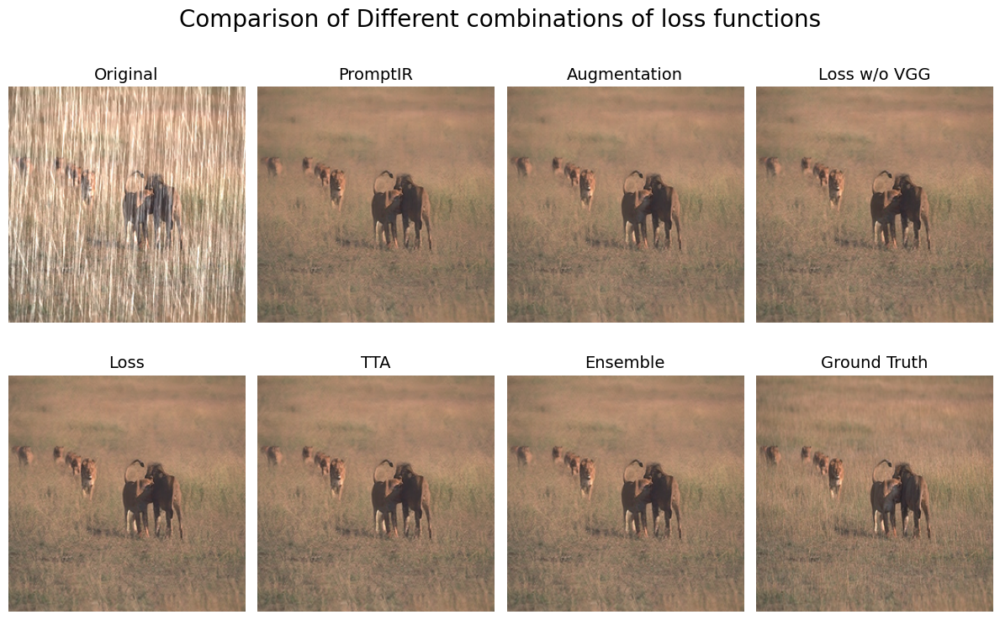
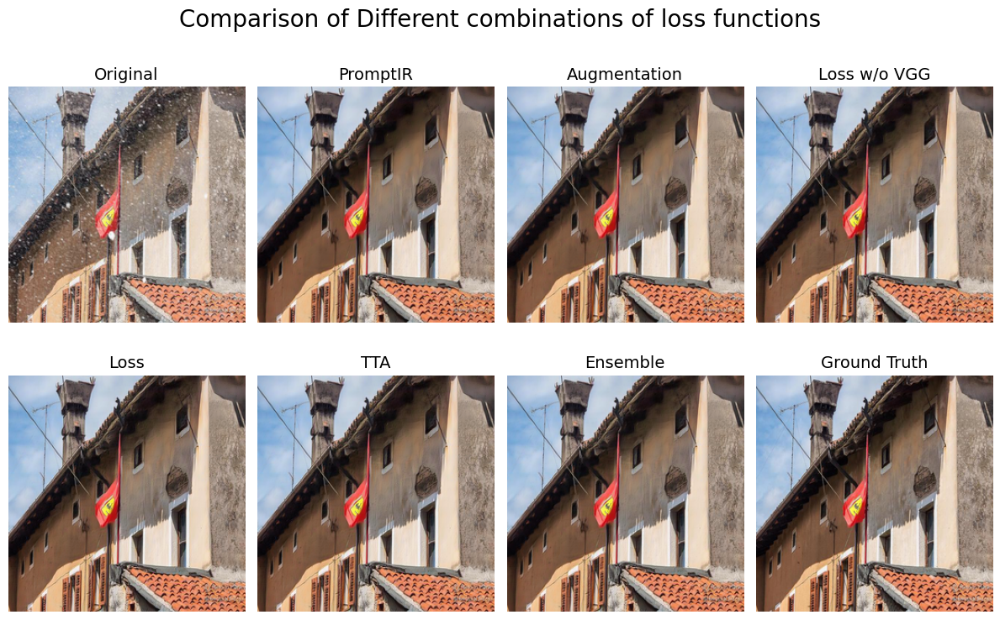

# NYCU DLVR HW4: Image Restoration



>[!NOTE]
> Author: 何義翔 (Yi-Hsiang, Ho)  
> StudentID: 111550106

## Introduction

This task involves image restoration, especially for two types of degradations — Derain and Desnow, using [PromptIR](https://github.com/va1shn9v/PromptIR). The dataset has 3,200 paired images, with degradation and the corresponding clean images, for training. Both deraining and desnowing task each have 1,600 images, and the degraded types are labeled as well. It also provides 100 images, without degraded type notations, for testing. The core idea of this work is to change the loss functions to cover more aspects of the clean image, apply test-time augmentation (TTA) to improve performance, and ensemble multiple models to achieve better results. The implementation is based on the official codebase of PromptIR

## Requirement

- Python 3.12
- PyTorch 2.6.0 with CUDA 12.4
- TensorBoard
- tqdm
- matplotlib
- scikit-image
- scikit-video
- albumentations
- wandb
- lightning
- kornia

It is recommended to use virtual environment. You can use Conda, venv, etc. The following commands are for Conda.

```bash
conda create --name DLVR_HW4 python=3.12
conda activate DLVR_HW4
pip install torch torchvision torchaudio tensorboard tqdm matplotlib scikit-image scikit-video albumentations wandb lightning kornia
```

## How to use

### Train

To train the model with default settings (in NVIDIA GeForce RTX 4090, it needs about 10 hours to train):

```bash
python train_loss.py --train
```
>[!WARNING]
> if you want to use `wanbd` to log the metrics, you need to sign up an account and copy the API key. After the script is run, a prompt will ask you to paste the API key you just copied.

To test the model with best checkpoint:

```bash
python train_loss.py --test
```

To test the model using ensemble, you need to edit `model_name1` to `nodel_name3`  to your model name, and change the model class to yours (if needed) in `test.py`. And run:

```bash
python test.py
```

You can also specify `--device` to set the GPU ID on the above scripts. For more information about all arguments, please use `--help`.

## Performance

**The PSNR results of different methods.**  “Val” refers to validation PSNR. “Test pub.” and “Test priv.” refer to public and private test set PSNR, respectively. PromptIR is treated as the baseline. If the value is higher than PromptIR, it is highlighted in blue, or it will be in red. The highest values in each column are also highlighted in bold. TTA and Ensemble are not evaluated in validation set, so the values are not available.

| Method            | Val PSNR | Test pub. PSNR | Test priv. PSNR |
| ----------------- | :------: | :------------: | :-------------: |
| PromptIR          | 28.9600  | 30.1508        | 29.3773         |
| Aug.              | 29.2972  | 30.0079        | 29.3440         |
| Loss w/o VGG      | 29.6007  | 30.3480        | 29.6707         |
| Loss              | 28.7450  | 30.2550        | 29.6516         |
| TTA               | -        | 30.5405        | 29.7865         |
| Ensemble          | -        | 30.7608        | 30.0588         |

**Visualization results.**





For more detail and experiment, please see the [report](/report/report.pdf).

## Repository Structure

```
├── train_loss.py                     # Main script for method "Loss"
├── train_loss_woVGG.py               # Main script for method "Loss w/o VGG"
├── train_loss_aug.py                 # Main script for method "Aug."
├── test.py                           # Script for ensemble testing
├── utils/                            # Utilization functions
├── net/                              # Model architecture
├── exp_src/                          # Experimental implementations (Scripts should be moved to the uppder directory to run)
│   ├── utils.py
│   ├── main_original.py              # The original implementation of PromptIR
│   ├── main_biasFree.py              # Using bias free layer normalization
│   ├── main_noRefine.py              # Remove refinement transformer block
│   ├── main_cosann.py                # Apply cosine annealing on scheduler
│   └── ...
├── data/                             # Please place your dataset here
│   ├── test_release/                 # Testing set
│   ├── train/                        # Training set
│   │   ├── clean/
│   │   │   ├── rain_clean-1.png
│   │   │   ├── rain_clean-2.png
│   │   │   ├── snow_clean-2.png
│   │   │   ├── snow_clean-2.png
│   │   │   └── ...
│   │   └── degraded/
│   │   │   ├── rain-1.png
│   │   │   ├── rain-2.png
│   │   │   ├── snow-2.png
│   │   │   ├── snow-2.png
│   │   │   └── ...
│   └── test/
└── report/                           # Project report
```

## License
This project is under ACADEMIC PUBLIC LICENSE, please see [LICENSE](LICENSE) for more detail.
